# Integrated SOC Automation Lab

A self-hosted Security Operations Center built from scratch on a single machine (5 VMs), wiring together a SIEM, an Incident Response Platform, a Threat Intelligence platform, and a SOAR engine into one automated detection-to-response pipeline — **no manual step between an attack and an enriched, documented case.**

> Built solo, end to end: infrastructure, installation, integration, and automation.

---

## 1. What this demonstrates

- Building and hardening security infrastructure from bare Ubuntu Server installs (Linux, networking, VMs, Docker)
- Making SIEM, SOAR and CTI systems talk to each other over REST APIs — real inter-system integration, not just single-tool usage
- Automating incident response end to end, a skill directly requested across the SOC/SOAR job market
- Debugging production-style integration failures (encoding, JSON formatting, API auth, variable resolution) by reading logs and forming hypotheses, not guessing

---

## 2. Architecture

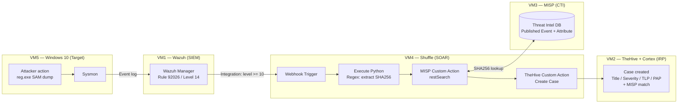

**Pipeline:** `Windows attack → Wazuh detects (Sysmon) → Webhook fires → Shuffle extracts the hash → MISP enrichment → TheHive case created automatically`

---

## 3. Lab infrastructure

| VM | Role | OS | RAM | vCPU | Disk | IP |
|---|---|---|---|---|---|---|
| VM1 | Wazuh (SIEM — indexer / manager / dashboard) | Ubuntu Server 22.04/24.04 | 6 GB | 2 | 40 GB | `192.168.138.145` |
| VM2 | TheHive 5 + Cortex 3 (IRP, via Docker) | Ubuntu Server 24.04 | 6 GB | 2 | 40 GB | `192.168.138.146` |
| VM3 | MISP (CTI, via Docker) | Ubuntu Server 24.04 | 2 GB | 2 | 30 GB | `192.168.138.147` |
| VM4 | Shuffle (SOAR, via Docker) | Ubuntu Server 24.04 | 4 GB | 2 | 20 GB | `192.168.138.148` |
| VM5 | Windows 10 Pro (attack target + Sysmon + Wazuh agent) | Windows 10 Pro | 4 GB | 2 | 40 GB | `192.168.138.149` |

Host: Intel Core i7-1265U (12th gen), 32 GB RAM. All VMs on VMware Workstation Pro, NAT network, thin-provisioned disks.

---

## 4. Components

| Component | Version | Purpose |
|---|---|---|
| [Wazuh](https://wazuh.com) | 4.9.2 | SIEM — log collection, Sysmon-based endpoint detection |
| [Sysmon](https://learn.microsoft.com/sysinternals/downloads/sysmon) | + SwiftOnSecurity config | Windows telemetry (process creation, hashes) |
| [TheHive](https://thehive-project.org) | 5.3.4 | Incident Response Platform — case management |
| [Cortex](https://github.com/TheHive-Project/Cortex) | 3.1.7 | Observable analysis engine (paired with TheHive) |
| [MISP](https://www.misp-project.org) | `coolacid/misp-docker:core-latest` | Threat Intelligence Platform — IOC database |
| [Shuffle](https://shuffler.io) | latest | SOAR — workflow orchestration engine |

---

## 5. The attack simulated

```powershell
reg save HKLM\SAM C:\sam_dump.hive
```

This is a **credential access** technique — dumping the Security Account Manager registry hive to later extract password hashes offline.

- **MITRE ATT&CK:** [T1003.002](https://attack.mitre.org/techniques/T1003/002/) — OS Credential Dumping: Security Account Manager
- **Wazuh rule:** `92026` — "Reg.exe used to dump SAM hive" (Level 14)
- **Detected via:** Sysmon Event ID 1 (Process Create) forwarded to Wazuh

---

## 6. What happens automatically, step by step

1. **Attack** runs on the Windows target.
2. **Sysmon** logs the process creation (command line, hashes, parent process).
3. **Wazuh** matches it against rule `92026` (level 14) and fires its `shuffle` integration — see [`wazuh-server/ossec.conf`](wazuh-server/ossec.conf).
4. **Shuffle** receives the alert on its webhook trigger.
   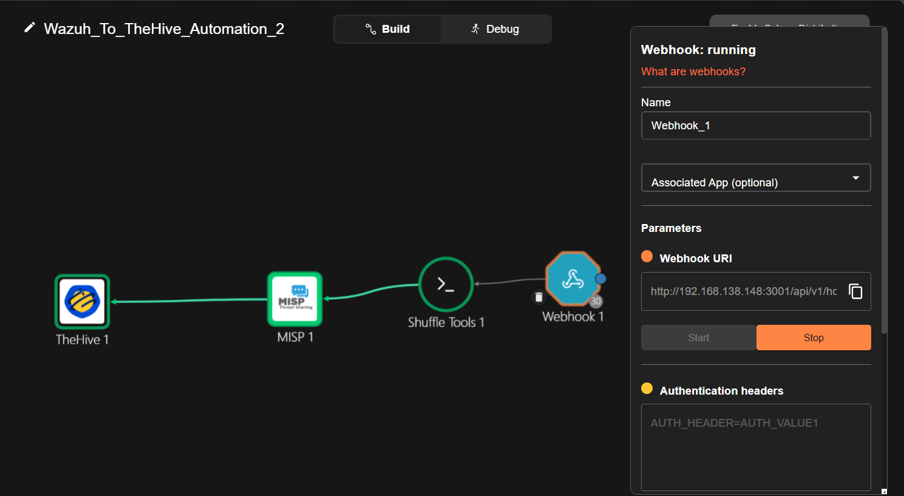
5. A **Python node** inside Shuffle extracts the SHA256 hash from the raw Sysmon log with a regex (writing custom Python here, instead of relying on Shuffle's built-in Regex Capture action, turned out to be the reliable path — see [Troubleshooting](docs/troubleshooting.md)).
   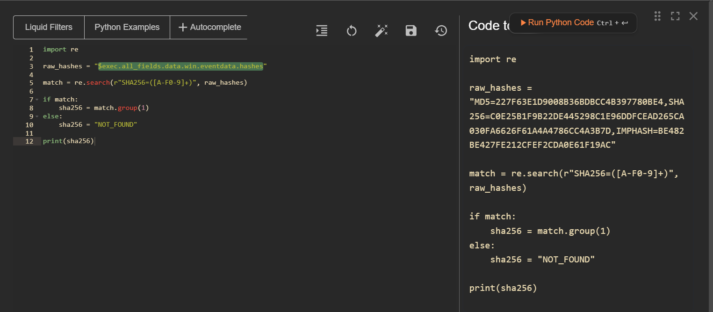
   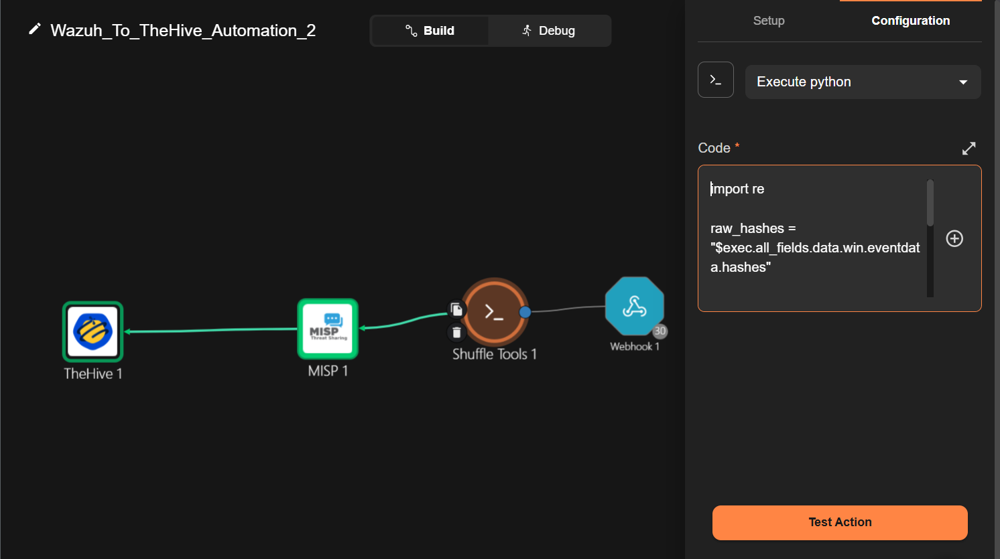
6. The hash is sent to **MISP** (`/attributes/restSearch`) to check whether it's a known indicator of compromise.
   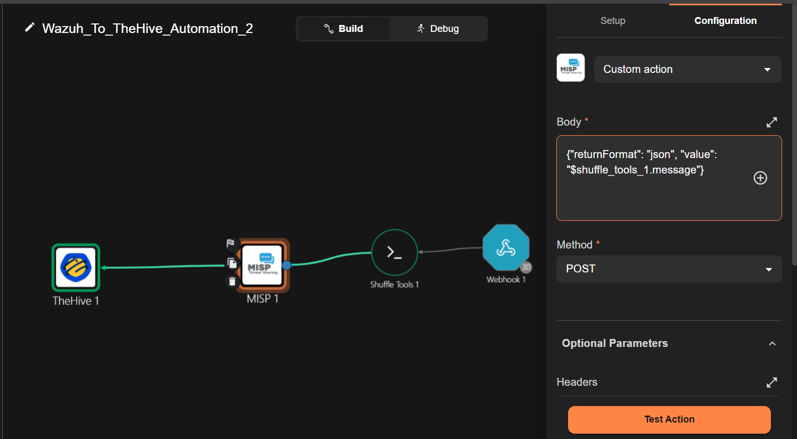
7. **TheHive** receives a `POST /api/v1/case`, with title, description, severity, TLP/PAP, and the MISP lookup result all mapped from live data — no static values.
   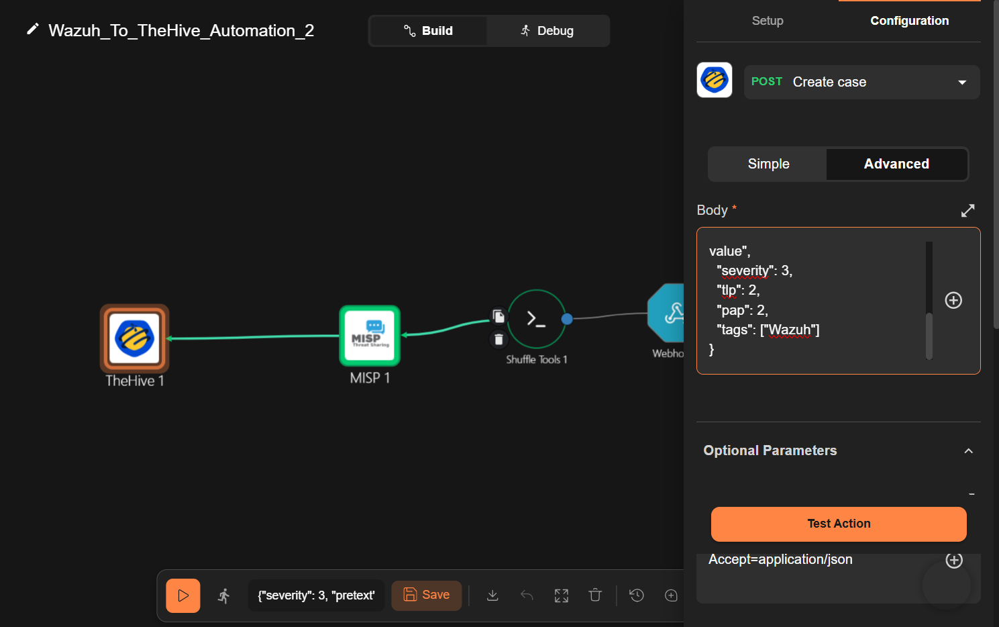
   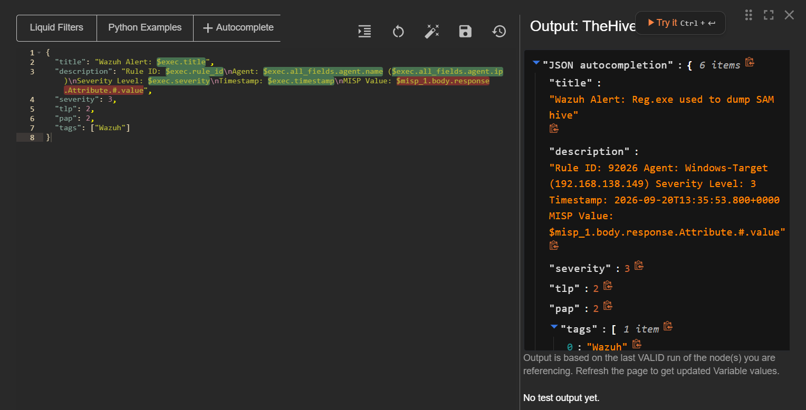
8. A new **Case** appears in TheHive, fully populated, with zero manual intervention.
   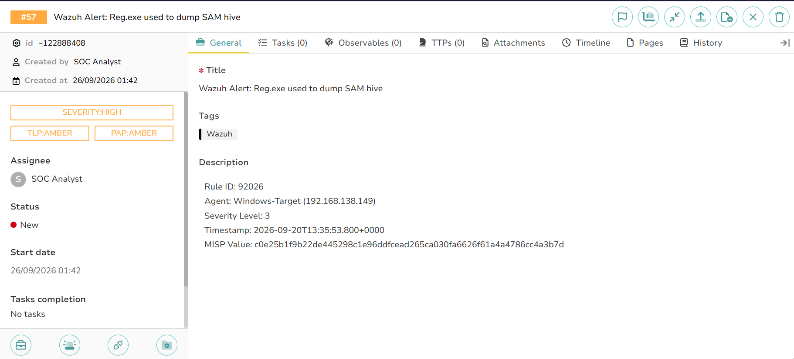

### Execution trace (a real run, end to end)

| Step | Result |
|---|---|
| Webhook payload received | 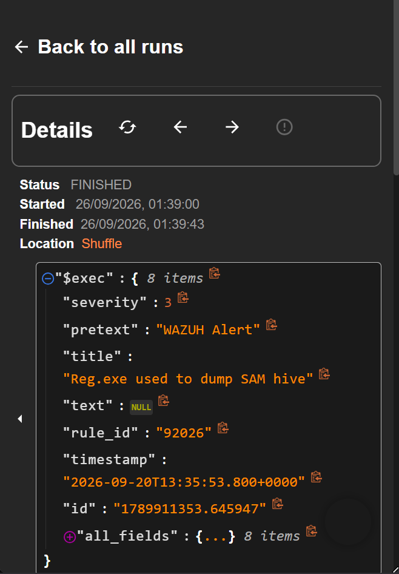 |
| Full execution detail | 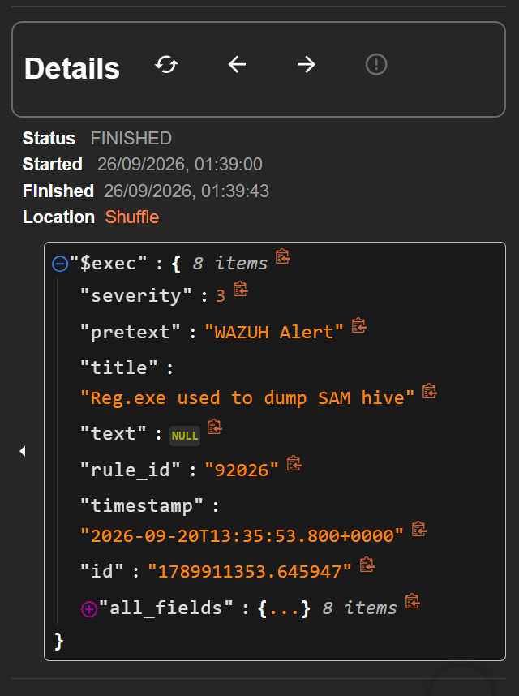 |
| Hash extracted by Python node | 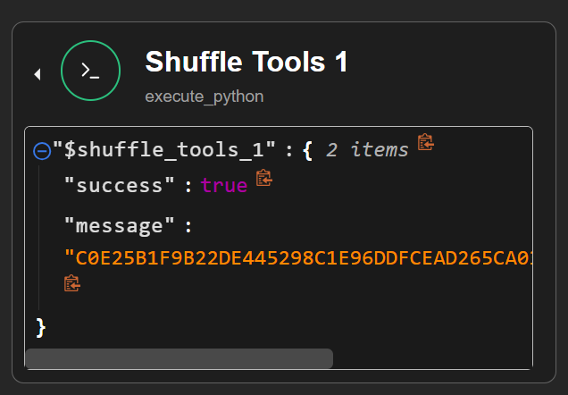 |
| MISP lookup — `200`, match found | 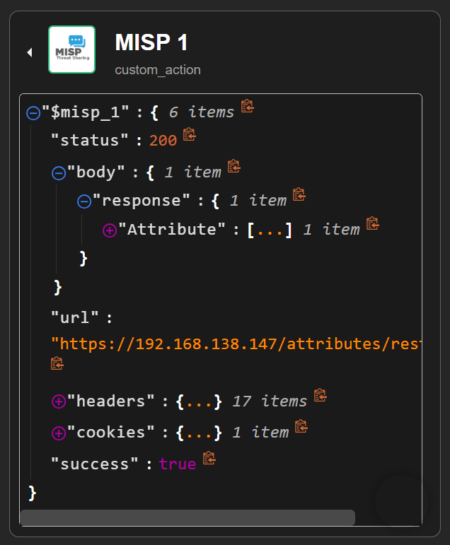 |
| TheHive case creation — `201` | 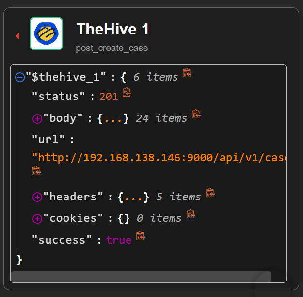 |

### Detection side (Wazuh)


### Threat Intelligence setup (MISP)

To validate the enrichment step against a real match (not just an empty lookup), the attack's SHA256 was added as a MISP attribute and the event published — proving the *No match* and *Match found* cases both behave correctly through the pipeline.

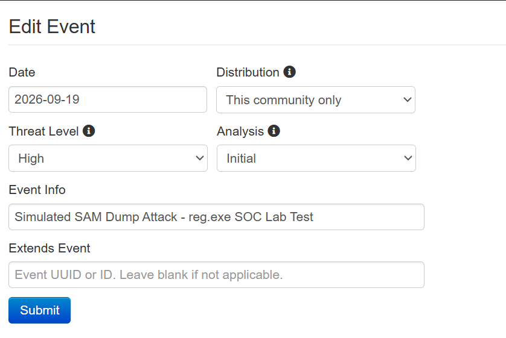
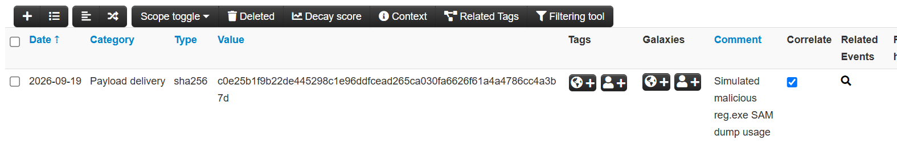
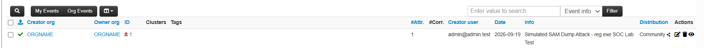

### TheHive organization setup

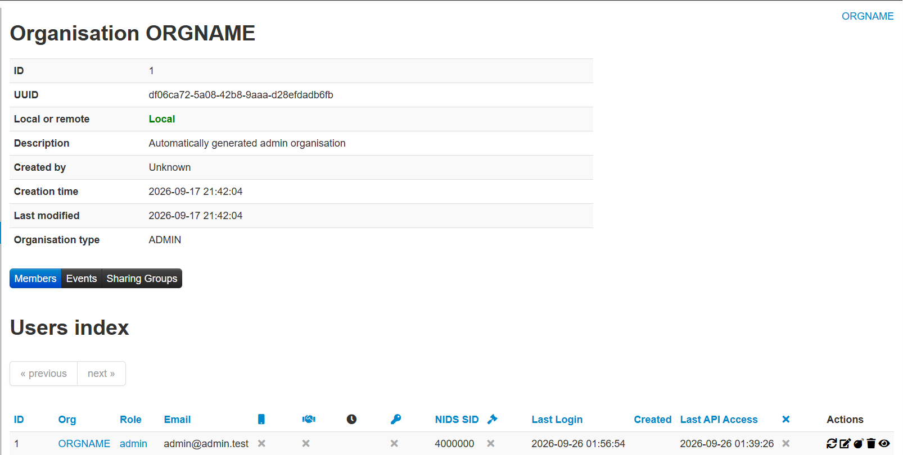

---

## 7. Repository contents

```
soc-automation-lab/
├── wazuh-server/
│   ├── ossec.conf                        # Wazuh manager config (Shuffle integration at the bottom)
│   └── legacy/custom-thehive.py          # Earlier direct Wazuh→TheHive script (superseded by Shuffle; kept for reference)
├── thehive-server/docker-compose.yml     # TheHive + Cortex + Elasticsearch + Cassandra
├── misp-server/docker-compose.yml        # MISP + MariaDB + Redis
├── shuffle-server/
│   ├── docker-compose.yml                # Shuffle stack (backend, frontend, OpenSearch, workers)
│   └── Wazuh_To_TheHive_Automation_2.json # Exported Shuffle workflow (import directly into Shuffle)
├── docs/troubleshooting.md               # Real issues hit while building this and how each was solved
└── images/                               # Screenshots referenced above
```

All secrets (API keys, DB passwords, TheHive/Cortex `--secret`) have been replaced with `<PLACEHOLDER>` values — generate your own before deploying.

---

## 8. Why this setup (design notes)

- **Docker for TheHive, MISP and Shuffle:** avoids Ubuntu 24.04 dependency hell (Cassandra/Elasticsearch version pinning), keeps each stack isolated and reproducible.
- **Wazuh installed natively (not Docker):** the official all-in-one installer manages indexer/manager/dashboard certificates and services more predictably than containerizing it for a single-node lab.
- **Shuffle as the single automation path:** an earlier direct Wazuh→TheHive script (`legacy/custom-thehive.py`) worked but skipped MISP enrichment and risked duplicate cases once Shuffle was wired in — it was disabled in `ossec.conf` once the Shuffle pipeline was validated end to end.
- **Python node over Shuffle's built-in Regex Capture** for hash extraction: more predictable variable output (`success` / `message`) than the array-based `group_0` fields, which resolved inconsistently between manual "Test Action" runs and live webhook executions. Details in [Troubleshooting](docs/troubleshooting.md).

---

## 9. Setup (high level)

1. Provision the 5 VMs per the table above (NAT network, static/DHCP-reserved IPs).
2. **Wazuh:** install via the [official all-in-one script](https://documentation.wazuh.com/current/quickstart.html), apply `wazuh-server/ossec.conf`.
3. **TheHive / MISP / Shuffle:** `docker compose up -d` in each respective folder (fill in the `<PLACEHOLDER>` secrets first).
4. **Windows target:** install Sysmon with the [SwiftOnSecurity config](https://github.com/SwiftOnSecurity/sysmon-config), enroll the Wazuh agent, disable Defender real-time protection for lab realism.
5. In Shuffle, import `shuffle-server/Wazuh_To_TheHive_Automation_2.json`, reconnect the MISP/TheHive API keys and the webhook, then activate it.
6. Point Wazuh's `shuffle` integration (`ossec.conf`) at the new webhook URL.
7. Trigger the attack (`reg save HKLM\SAM ...`) and watch the case appear in TheHive.

Full step-by-step install notes and every error hit along the way are in [`docs/troubleshooting.md`](docs/troubleshooting.md).

---

## Disclaimer

Built entirely in an isolated lab network for educational purposes. Not connected to production systems. Do not run the attack simulation commands against systems you do not own or have explicit authorization to test.
